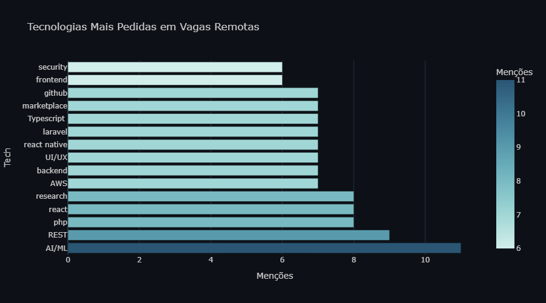
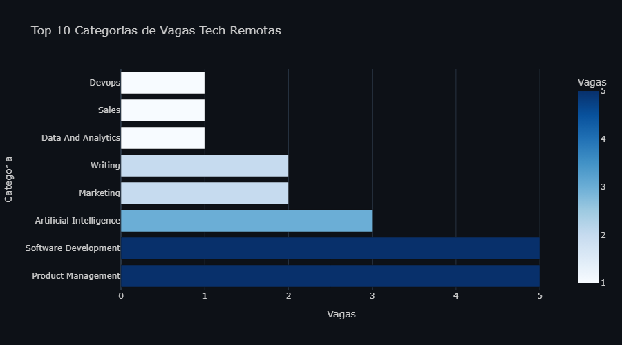

# tech-jobs-br

Análise automatizada do mercado de vagas tech remotas.
Coleta · limpeza · visualização. Python moderno com uv.

## Insights




- **X vagas** coletadas de **Y empresas**
- Tecnologias mais pedidas: Python, TypeScript, React...
- **Z%** das vagas não informam salário

## Como rodar

```powershell
git clone https://github.com/Vinicius154/tech-jobs-br
cd tech-jobs-br

# instala uv se não tiver
powershell -ExecutionPolicy ByPass -c "irm https://astral.sh/uv/install.ps1 | iex"

uv run scrape    # coleta
uv run clean     # limpa
uv run viz       # gera gráficos em assets/
```

## Stack

Python 3.13 · uv · httpx · Pandas · Plotly · Jupyter
